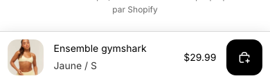
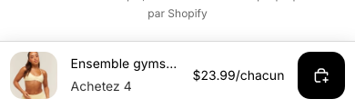
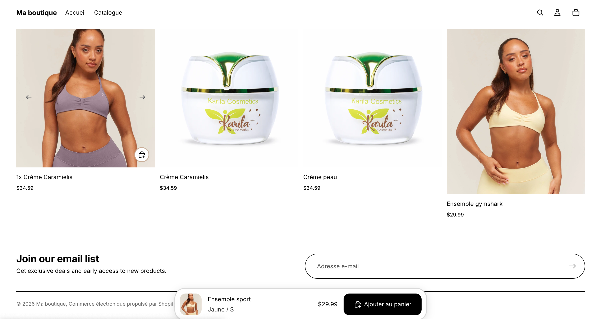

<a href="README.md">Read in English</a>

# Sticky Add-To-Cart — barre d'achat flottante compatible sélecteur de bundle

Un correctif + une extension pour la barre d'achat flottante native de
Shopify **Horizon** : elle apparaît une fois les boutons d'achat sortis de
l'écran, et contrairement à la version native, elle continue de fonctionner
— et reste synchronisée — quand un sélecteur de paliers/bundle (comme
[Bundle Selector](https://github.com/pteyo032/shopify-bundle-selector))
remplace le formulaire d'achat natif du thème.

Aucune app tierce, aucune nouvelle dépendance — un petit patch sur trois
fichiers JS natifs de Horizon.

| Par défaut (variante native) | Synchronisée sur le palier sélectionné |
|---|---|
|  |  |

Aussi visible sur desktop, sous forme de pastille flottante plutôt qu'une barre pleine largeur :

## Le problème corrigé

La barre sticky de Horizon repère le formulaire d'achat du produit via un
sélecteur fixe (`product-form-component[data-product-id="..."]`). Si votre
thème remplace cet élément par autre chose — ce que fait un sélecteur de
paliers/bundle — la recherche échoue silencieusement et la barre ne
s'active jamais. Aucune erreur console, rien de visiblement cassé, elle
n'apparaît simplement jamais. Voir `docs/gotchas.md` pour le détail complet.

## Contenu de ce repo

Pas le thème Horizon complet — seulement les fichiers corrigés et la doc
pour les appliquer au vôtre.

| Fichier | Rôle |
|---|---|
| `assets/sticky-add-to-cart.js` | Fichier natif corrigé — reconnaît un composant d'achat alternatif, se synchronise via `BundleTierChangeEvent` |
| `assets/events.js` | Fichier natif corrigé — ajoute `ThemeEvents.bundleTierChange` / `BundleTierChangeEvent` |
| `assets/bundle-selector.js` | Fichier natif corrigé — dispatch le nouvel événement au changement de palier (utile seulement si vous utilisez un sélecteur de paliers/bundle) |
| `docs/integration-guide.md` | Étapes exactes pour appliquer ça à votre propre thème, avec ou sans sélecteur de bundle |
| `docs/gotchas.md` | Pièges techniques rencontrés en construisant ce correctif |

## Démarrage rapide

1. Si vous voulez juste la barre sticky native de Horizon, sans sélecteur
   de paliers : rien à installer — activez **Barre d'ajout au panier
   flottante** sur la section informations produit, dans l'éditeur de
   thème.
2. Si un sélecteur de paliers/bundle la casse : voir
   `docs/integration-guide.md` pour les deux changements nécessaires
   (remplacer trois fichiers JS, ajouter une classe CSS).

## Licence

MIT — voir `LICENSE`.
